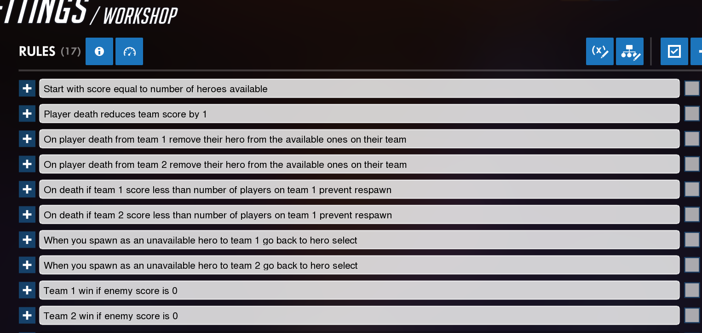
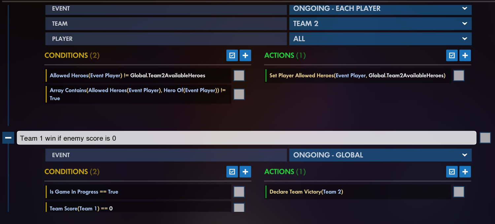
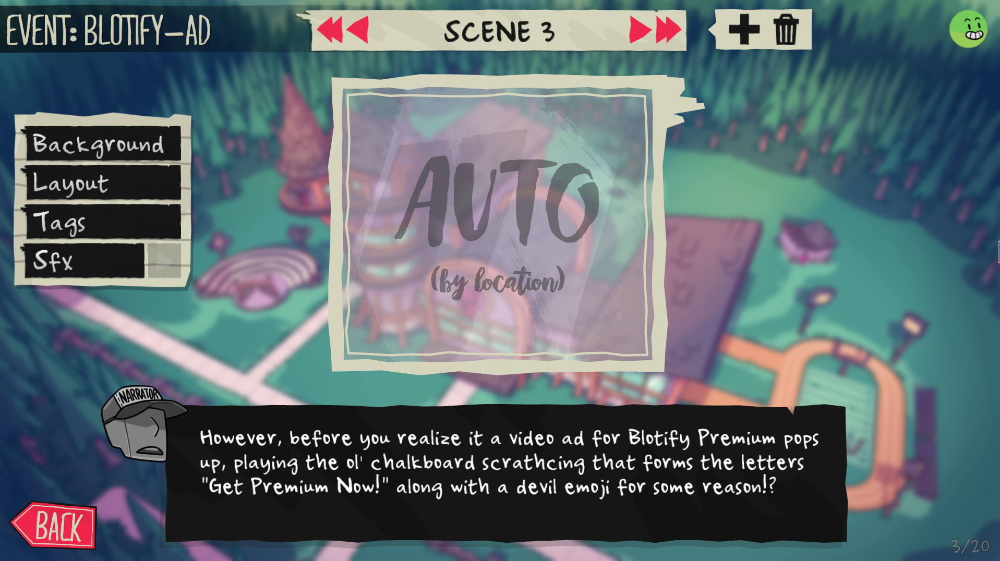
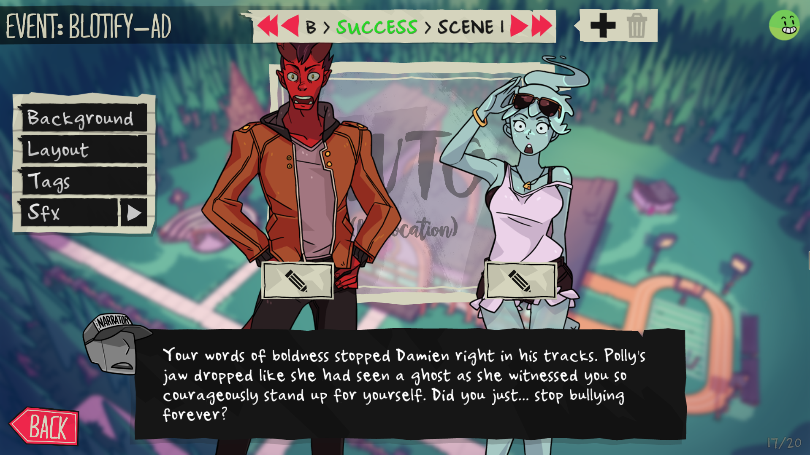

# Mods portfolio
# Overwatch:
## Each Hero Lives Once Workshop Mod
Made a 6v6 custom game mode using the Overwatch Workshop 
Rules: 
Both teams start with a score equal to the current number of heroes in the game 
Players cannot pick the same hero as a teammate 
When a player dies their team's score is reduced by one and their hero becomes unavailable for their team so they have to select a different hero and then respawn 
When a player dies and their team's score is less than the players in their team they enter spectate instead of respawning 
The team who reaches a score of 0(meaning they run out of heroes) first loses the game 
Workshop Code: GQSRQF 
 
 
# Monster Prom:
## "Blotify Premium Sub" Item+Event
Made an event based on an item parody of Spotify using the in-game Mod Tool 
Created the art for a new item with Photoshop and wrote the dialogue for its event 
 
 
[Steam Workshop link](https://steamcommunity.com/sharedfiles/filedetails/?id=2094099960)
